# 📐 Technical Design Document: TA Converter

| Document Version | 1.0 |
| :--- | :--- |
| **Project Status** | Production |
| **Last Updated** | February 2026 |
| **Author** | Muhammad Fahad |

---

## 1. Executive Summary
**TA Converter** is a full-stack currency exchange platform designed to provide real-time and historical exchange rates. The system ensures high availability, low latency, and a seamless user experience across devices through a decoupled Client-Server architecture.

## 2. System Architecture

The system follows a **Layered Monorepo Architecture**, separating concerns between the presentation layer (Client) and the business logic layer (Server).

### 2.1 High-Level Architecture Diagram
This diagram illustrates the data flow between the User, the Client Application, the NestJS Backend, and External Providers.

```mermaid
graph TD
    User((👤 User))
    subgraph "Client Layer (Vite + React)"
        UI[User Interface]
        Store[Local Storage Cache]
    end
    
    subgraph "Server Layer (NestJS)"
        Controller[API Controller]
        Service[Currency Service]
        Filter[Global Exception Filter]
    end
    
    ExtAPI["☁️ External Currency API (Frankfurter/ExchangeRate)"]

    User <-->|HTTPS| UI
    UI <-->|Read/Write| Store
    UI <-->|REST / JSON| Controller
    Controller -->|DTO Validation| Service
    Service -->|Axios Request| ExtAPI
    Service -.->|Error Handling| Filter
```

---

## 3. Functional Requirements

### 3.1 Core Features
* **Real-Time Conversion:** Users must be able to convert any supported currency to another with up-to-date rates.
* **Historical Data:** Users can select a past date to view exchange rates from that specific day.
* **Conversion History:** The system must persist the last 10 conversions locally for quick reference.
* **Smart Defaults:** Input fields should handle edge cases (e.g., clearing "0" on focus, preventing negative numbers).

### 3.2 User Interface (UI/UX)
* **Responsive Layout:** The interface must adapt between Stack View (Mobile) and Grid View (Desktop).
* **Theme Toggle:** A system-aware Dark/Light mode switch with persistent preference storage.
* **Visual Feedback:** Loading spinners during API calls and clear error alerts for network failures.

---

## 4. Non-Functional Requirements (NFRs)

### 4.1 Performance
* **Load Time:** First Contentful Paint (FCP) under 1.5 seconds.
* **API Latency:** Backend processing time should remain under 200ms (excluding external API latency).

### 4.2 Security
* **Input Sanitization:** All incoming requests are validated using DTOs (Data Transfer Objects) with `class-validator` to prevent injection attacks.
* **CORS Policy:** Strict Cross-Origin Resource Sharing rules to prevent unauthorized domain access.

### 4.3 Reliability
* **Graceful Degradation:** If the external API fails, the user receives a friendly error message rather than a white screen.
* **Type Safety:** strictly typed TypeScript codebase to minimize runtime errors.

---

## 5. API Specification

The backend exposes a RESTful API via the `/api/currency` prefix.

### 5.1 Endpoints

| Method | Endpoint | Description | Query Params |
| :--- | :--- | :--- | :--- |
| `GET` | `/latest` | Get current exchange rate | `?base=USD` |
| `GET` | `/historical` | Get rate for a specific date | `?date=YYYY-MM-DD&base=USD` |

### 5.2 Sequence Diagram: Conversion Flow
The following sequence details the lifecycle of a conversion request.

---

## 6. Data Model

Although the system is currently stateless (no database), we utilize structured interfaces for internal data handling.

### 6.1 Conversion Record (Client-Side)

---

## 7. CI/CD Pipeline strategy

We utilize **GitHub Actions** to enforce code quality standards.

* **Trigger:** Push to `main` or `dev`.
* **Job 1 (Backend):** Installs dependencies -> Builds NestJS -> Runs Unit Tests (`npm run test`).
* **Job 2 (Frontend):** Installs dependencies -> Verifies React Build.
* **Deployment:** Automatic deployment to Vercel Serverless Functions upon successful merge to `main`.