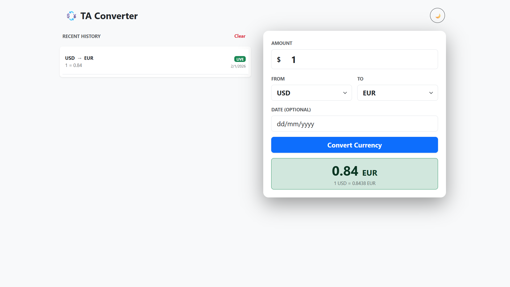
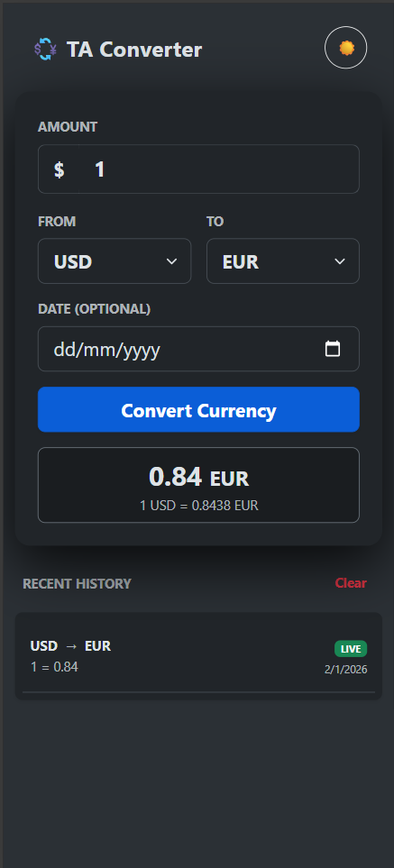

# 💱 Full-Stack Currency Converter (TA Converter)

A robust, mobile-responsive, and scalable currency converter application built with a **Modern React Frontend** and an **Enterprise-grade NestJS Backend**.


---

## 📸 Screenshots

| Desktop View | Mobile View |
|:---:|:---:|
|  |  |

---

## 🚀 Features

- **Live & Historical Rates:** Fetches real-time data and historical exchange rates via external APIs.
- **Smart Caching & History:** Persists recent conversions using `localStorage` for privacy and speed.
- **Responsive Design:** Fully optimized for Mobile (Stack view) and Desktop (Grid view) using Bootstrap.
- **Dark Mode:** System-aware theme toggling.
- **Robust Error Handling:** Global Exception Filters on the backend to standardize error responses.
- **Input Validation:** Strict DTO (Data Transfer Object) validation ensures API safety.

---

## 🛠️ Tech Stack & Architecture Decisions

### **Frontend (Client)**
Located in `/client`. We chose **Vite + React** for lightning-fast HMR (Hot Module Replacement) and build performance.

- **Framework:** React 18 (Functional Components + Hooks).
- **Language:** TypeScript (Strict typing for maintainability).
- **Styling:** Bootstrap 5 (Grid system for rapid mobile-first layout).
- **State Management:** React `useState` + `useEffect` (Kept simple to avoid Redux bloat for this scale).
- **HTTP Client:** Axios (For robust API requests).

### **Backend (Server)**
Located in `/server`. We chose **NestJS** because it provides an "Angular-like" modular structure, making the backend testable, scalable, and readable.

- **Framework:** NestJS (Node.js framework).
- **Language:** TypeScript.
- **Validation:** `class-validator` & `class-transformer` (Auto-validates incoming request bodies/params).
- **Architecture:** Modular (Controller-Service-Repository pattern).
- **Deployment:** Vercel Serverless (using `vercel-adapter` to bridge NestJS to serverless functions).

---

## 📂 Project 

For a detailed breakdown of the system architecture, sequence diagrams, and requirements, please refer to the [Technical Design Document](./DESIGN.md).

```bash
root/
├── client/                 # Frontend Application
│   ├── src/
│   │   ├── components/     # Reusable UI Blocks (History, ConverterCard)
│   │   ├── views/          # Page Logic (Home.tsx - Separates Logic from Router)
│   │   ├── utils.ts        # API helpers & Storage logic
│   │   └── App.tsx         # Main Entry / Router
│   └── .env                # Client Environment Variables
│
├── server/                 # Backend Application
│   ├── src/
│   │   ├── common/         # Shared utilities
│   │   │   └── filters/    # Global HTTP Exception Filter
│   │   ├── currency/       # Currency Module
│   │   │   ├── dto/        # Data Transfer Objects (Validation schemas)
│   │   │   ├── currency.controller.ts # Route Definitions
│   │   │   └── currency.service.ts    # Business Logic (API calls)
│   │   └── main.ts         # App Entry Point & CORS Config
│   └── vercel.json         # Serverless Config
```

---

## ⚡ Getting Started

### Prerequisites
- Node.js (v18 or higher)
- npm or yarn

### 1. Backend Setup
```bash
cd server
npm install

# Create .env file in server/
echo "CURRENCY_API_KEY=your_api_key_here" > .env
echo "PORT=3000" >> .env

# Run Development Server
npm run start:dev
```
_The server will start at `http://localhost:3000`_

### 2. Frontend Setup
```bash
cd client
npm install

# Create .env file in client/
echo "VITE_BACKEND_URL=http://localhost:3000/api/currency" > .env

# Run Development Server
npm run dev
```
_The client will start at `http://localhost:5173`_

---

## 🔧 Modification Guide (For Developers)

### **Scenario 1: Adding a New Page**
1. Create a new component in `client/src/views/MyPage.tsx`.
2. Import and render it in `client/src/App.tsx`.

### **Scenario 2: Changing the Currency API Provider**
1. Open `server/src/currency/currency.service.ts`.
2. Modify the `axios.get()` call inside `getLatestRates` to point to your new provider.
3. Map the new response format to the existing return type.

### **Scenario 3: Adding New Validation Rules**
1. Open `server/src/currency/dto/get-rate.dto.ts`.
2. Add decorators like `@IsInt()`, `@Min(0)` to the class properties.
3. The Global Validation Pipe in `currency.controller.ts` handles the rest automatically.

---

## ☁️ Deployment (Vercel)

This project is optimized for a monorepo-style deployment on Vercel.

1. **Push to GitHub:** Ensure your `main` branch is up to date.
2. **Deploy Backend:**
   - Import repo to Vercel.
   - Root Directory: `server`.
   - Add Env Var: `CURRENCY_API_KEY`.
   - **Important:** Disable "Deployment Protection" in Vercel Settings if using a free account.
3. **Deploy Frontend:**
   - Import repo to Vercel (Create new project).
   - Root Directory: `client`.
   - Add Env Var: `VITE_BACKEND_URL` pointing to your deployed backend domain (e.g., `https://my-api.vercel.app/api/currency`).

---

## 🛡️ License
Distributed under the MIT License. See `LICENSE.txt` for more information.